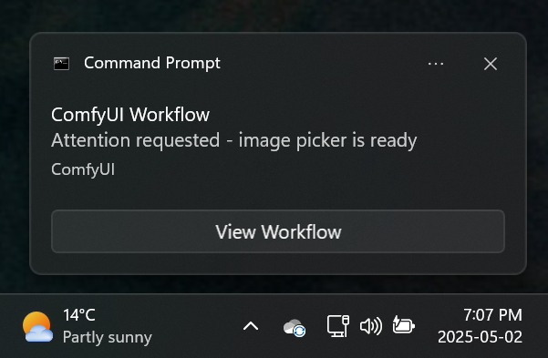

# ComfyUI-Liebs-Toast

A node to display a toast notification. Use it to send a toast when your prompt is complete. Also pairs well with [ComfyUI-Liebs_Picker](https://github.com/marklieberman/ComfyUI-Liebs-Picker) and [cg-image-filter](https://github.com/chrisgoringe/cg-image-filter) to be notified when the picker is waiting.

## Features

* Display a toast notification.

* Customize the toast message, duration, and/or silence the notification audio.

* Setting to skip the toast if the browser tab is already visible.

* **[Browser add-on required]** "View Workflow" button in the toast will bring focus to the browser tab that sent the toast.

| Screenshot | Description |
| :---- | :---- |
|  | An example workflow with two toasts. The first toast is triggered when the image batch from the VAE Decode is available. It is used to get your attention for the image picker node. The second toast is triggered after the SD Ultimate Upscae is complete, and announces that the prompt is finished. |
|  | A toast on Windows. The **View Workflow** button is displayed when the companion browser add-on is installed. |

## Browser Add-on

The browser add-on allows the Python node to activate the browser tab when you click the **View Workflow** button in the toast. The button will not appear in the toast if the add-on is not installed.

### Installation

Install the add-on from your browser's add-on store.

* Chrome: not available yet.
* Edge: not available yet.
* Firefox: not available yet.

### Permissions

By default the add-on will only request permission to run on `http://127.0.0.1:8188/*`. You must request additional permissions in the add-on's options to run the add-on on other domains or ports.

## Limitations

* Currently only Windows is supported. Help to implement support for additional platforms would be appreciated.
